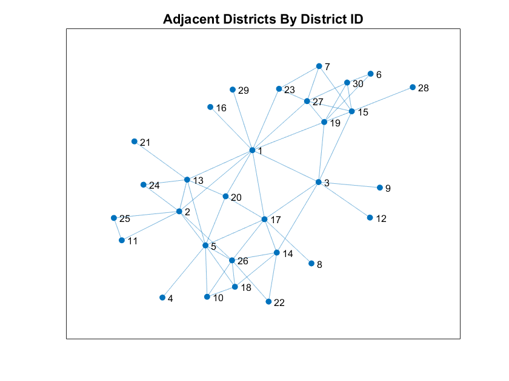
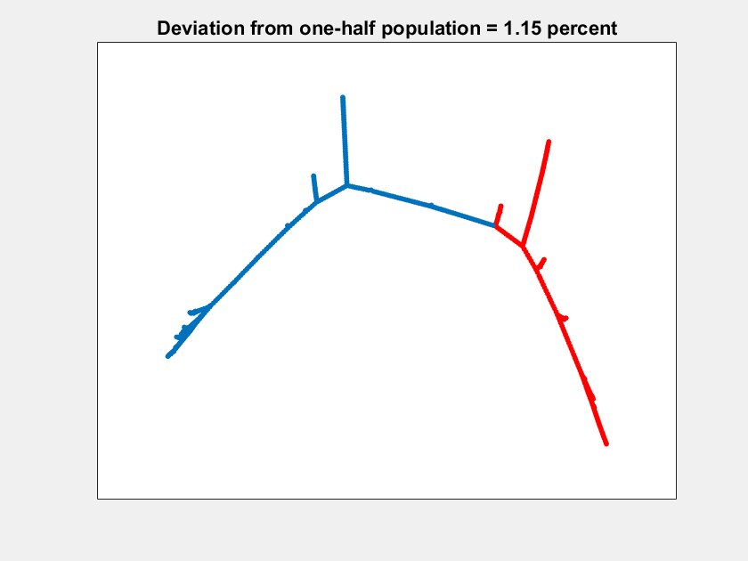
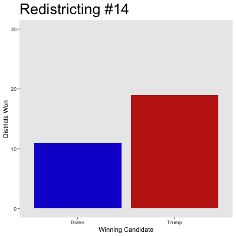

# Gerrymander
Discrete Math FA2022

## Code Structure
The main code that runs our ReCom algorithm is inside the `recom_function` folder. Within that folder, the main script is `recomb.m`. Run that and it should eventually start generating and saving random district maps. There are three figures that should pop up after about a minute of runtime, representing the different steps in the algorithm.

The ReCom algorithm has three stages:
1. Identify adjacent districts and pick two districts to combine. This is done with a call to the function `find_all_adjacent_districts.m`.
2. Draw a spanning tree that spans every node in the two districts. This is done in `spanning_tree.m`.
3. Split the spanning tree along an edge that (heuristically) minimizes the population difference between the two districts. This is done in `split_tree.m`.

Initial data processing for the algorithm, as well as interpretation of the results, is done in R inside the `districting_results` folder.

### 1: Graph of adjacent districts for one iteration of ReCom

### 2: Animation of the tree splitting algorithm for one iteration of ReCom

### 3: Animated map of Texas over 100 iterations of the ReCom algorithm

### 4: Simulated election outcomes for 100 non-consecutive iterations of the ReCom algorithm
